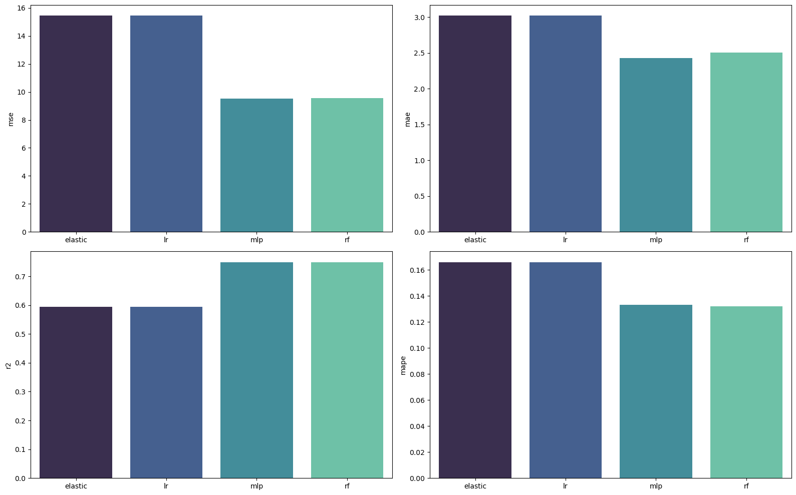

# Boston House Pricing Project Readme

## Overview

This project focuses on predicting house prices in Boston using various machine learning models. Four models were implemented, employing both grid search and randomized search for hyperparameter tuning. K-fold cross-validation, train-test split, and multiple error metrics were utilized to assess model performance.

## Steps Taken

### 1. Data Cleaning

- Removed all NaN values to ensure a clean dataset.
- Identified and dropped outliers to enhance model robustness.

### 2. Data Splitting

- Utilized the train-test split methodology for model training and evaluation.

### 3. Cross-Validation

- Implemented K-fold cross-validation to assess model generalization.

### 4. Model Implementation

- Employed four different machine learning models for house price prediction.
- Utilized grid search and randomized search for hyperparameter optimization.

#### Elastic Net

The Elastic Net regularization term is a combination of L1 (Lasso) and L2 (Ridge) regularization. The objective function is given by:

$$ \text{Elastic Net Loss} = \frac{1}{2N} \sum_{i=1}^{N} (y_i - \hat{y}_i)^2 + \alpha \left( \lambda \sum_{j=1}^{p} |\beta_j| + \frac{1}{2} (1 - \lambda) \sum_{j=1}^{p} \beta_j^2 \right)

- \(N\) is the number of observations.
- \(y_i\) is the observed value for the \(i\)-th observation.
- \(yhat_i\) is the predicted value for the \(i\)-th observation.
- \(beta_j\) are the coefficients of the features.
- \(p\) is the number of features.
- \(lambda\) controls the mix between L1 and L2 regularization.
- \(alpha\) is the overall regularization strength.

#### MLP (Multi-Layer Perceptron)

The objective function for Multi-Layer Perceptron (MLP) involves minimizing the mean squared error:

$$
\text{MLP Loss} = \frac{1}{2N} \sum_{i=1}^{N} (y_i - \hat{y}_i)^2
$$

- \(N\) is the number of observations.
- \(y_i\) is the observed value for the \(i\)-th observation.
- \(yhat_i\) is the predicted value for the \(i\)-th observation.

#### Random Forest

The objective function for Random Forest involves an ensemble of decision trees, and the overall loss is based on the specific metric used (e.g., mean squared error for regression):

$$
\text{Random Forest Loss} = \frac{1}{N} \sum_{i=1}^{N} (y_i - \hat{y}_i)^2
$$

- \(N\) is the number of observations.
- \(y_i\) is the observed value for the \(i\)-th observation.
- \(yhat_i\) is the predicted value for the \(i\)-th observation.

#### Linear Regression

The objective function for Linear Regression involves minimizing the mean squared error:

$$
\text{Linear Regression Loss} = \frac{1}{2N} \sum_{i=1}^{N} (y_i - \hat{y}_i)^2
$$

- \(N\) is the number of observations.
- \(y_i\) is the observed value for the \(i\)-th observation.
- \(yhat_i\) is the predicted value for the \(i\)-th observation.

### 5. Evaluation Metrics

- Employed multiple error metrics to comprehensively evaluate model performance.
- Metrics include but are not limited to Mean Squared Error (MSE), Mean Absolute Error (MAE), R2 Score (R2) and Mean Absolute Percentage Error(MAPE).

#### MAPE (Mean Absolute Percentage Error)

$$
\text{MAPE} = \frac{1}{N} \sum_{i=1}^{N} \left| \frac{y_i - \hat{y}_i}{y_i} \right| \times 100
$$

- \(N\) is the number of observations.
- \(y_i\) is the observed value for the \(i\)-th observation.
- \(yhat_i\) is the predicted value for the \(i\)-th observation.

#### MAE (Mean Absolute Error)

$$
\text{MAE} = \frac{1}{N} \sum_{i=1}^{N} \left| y_i - \hat{y}_i \right|
$$

- \(N\) is the number of observations.
- \(y_i\) is the observed value for the \(i\)-th observation.
- \(yhat_i\) is the predicted value for the \(i\)-th observation.

#### MSE (Mean Squared Error)

$$
\text{MSE} = \frac{1}{N} \sum_{i=1}^{N} (y_i - \hat{y}_i)^2
$$

- \(N\) is the number of observations.
- \(y_i\) is the observed value for the \(i\)-th observation.
- \(yhat_i\) is the predicted value for the \(i\)-th observation.

#### R2 (R-squared)

$$
R^2 = 1 - \frac{\sum_{i=1}^{N} (y_i - \hat{y}_i)^2}{\sum_{i=1}^{N} (y_i - \bar{y})^2}
$$

- \(N\) is the number of observations.
- \(y_i\) is the observed value for the \(i\)-th observation.
- \(yhat_i\) is the predicted value for the \(i\)-th observation.
- \(y_bar\) is the mean of the observed values.

#### Results 

## Dependencies

- Python 3.11
- Necessary libraries (scikit-learn, pandas, etc.)
